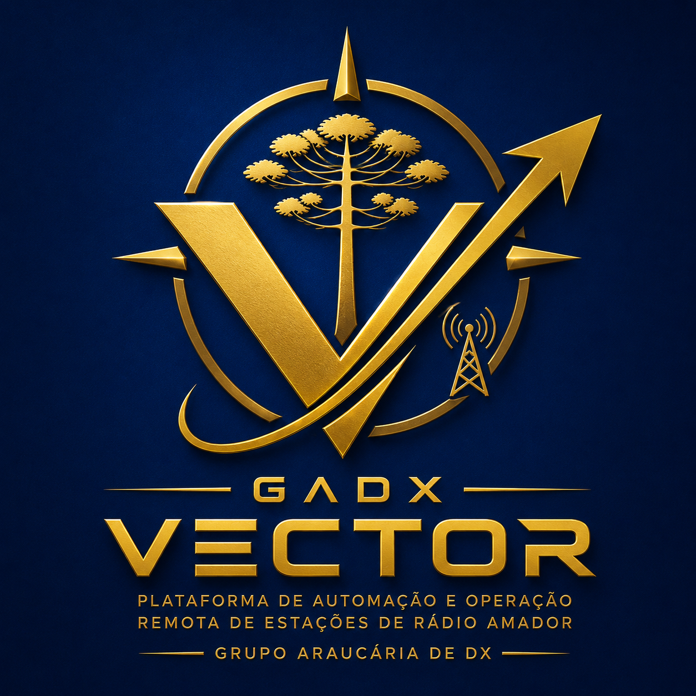

# GADX Vector

  

**GADX Vector** é a plataforma de automação e operação remota de estações de rádio amador desenvolvida pelo **Grupo Araucária de DX (GADX)**.

## O nome Vector

**Vector** remete imediatamente a **direção**, **azimute**, **trajetória** e **precisão**, conceitos muito presentes no radioamadorismo.

1. Também remete à engenharia — vetores, direção e magnitude — o que combina muito com o perfil do projeto.
2. É curto, fácil de pronunciar em português e inglês.
3. Funciona muito bem como marca de produto.

## Estrutura do produto

- **Vector Gateway** — serviço instalado em cada site e responsável pelos recursos locais, sessões, autorização e integração com equipamentos.
- **Vector Client** — componente executado no computador do operador, oferecendo interface Web e integração local com N1MM, DXLog e outros softwares.
- **Vector Protocol** — protocolo interno de comunicação entre Client e Gateway, independente do Hamlib e de protocolos CAT específicos.

## Estrutura do repositório

- `docs/` — documentação funcional e arquitetural do GADX Vector.
- `vector-gateway/` — implementação do Vector Gateway.
- `vector-client/` — implementação do Vector Client.
- `shared/` — modelos, contratos e componentes compartilhados.
- `emulator/` — emulação CAT e testes de compatibilidade com softwares de rádio.
- `tools/` — ferramentas auxiliares de desenvolvimento e diagnóstico.
- `tests/` — testes automatizados e cenários de integração.
- `assets/branding/` — identidade visual, logo, paleta, tipografia e diretrizes de marca.

## Identidade visual

A imagem [`assets/branding/logo-v0.1.png`](assets/branding/logo-v0.1.png) é a **logo conceitual v0.1** do GADX Vector e serve como referência para a evolução da identidade visual do produto.

Os documentos de identidade visual ficam em [`assets/branding/`](assets/branding/).

## Documentação

Comece por [`docs/00-VisaoGeral.md`](docs/00-VisaoGeral.md) e siga a ordem numérica dos documentos.

## Estado

Projeto em fase de definição arquitetural e preparação da prova de conceito.
